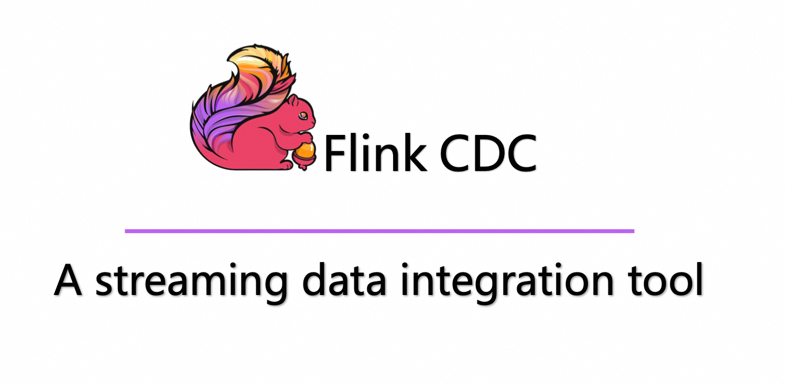

  

# 基于 3.1.1 版本的功能增强
## 一、支持重启更新内部表 Schema 信息
- 背景：

3.1.1 版本在同步过程中如果业务方对监听的表字段类型做了修改，比如字段是否为空做了更改，当前版本是无法捕捉到的。这样在解析输出到下游后，就会同数据源有差异。

比如：表中有个数值型字段，监听刚开始时不允许为空，开启同步后中途被改成允许为空了，那么CDC会对该字段为NULL的数据基于内部表schema信息覆盖成0。这样业务库对应的列为NULL，而下游是为0。

即使重启也无效。因为 savepoint/checkpoint 保存的表schema信息，只做了新增表时的增加，不支持对表中途schema的修改；且不支持删除无效表，这样理论上state会不断增大。

- 增强功能：

在启动时，重新获取全量所有表的schema信息

